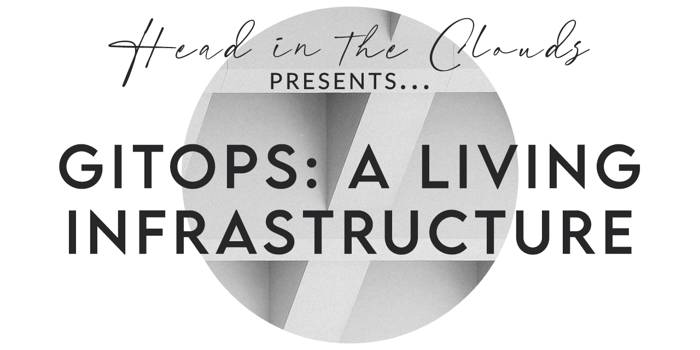

# NC-GitOps-HeadInTheClouds

# Introduction

This was the final project for the Head in the Clouds team during our Northcoders Cloud Engineering course.

The team consists of Alex Doyle @AM-Doyle, Jawad Ahmed @jawadscloud, Kay Kazmierczak @kay-hk and Valeria Bykova @Lera-Bykova.

We worked together over the course of a week and a half to produce a DevOps environment for our app including CI, CD, and monitoring.

This was a fantastic opportunity to showcase our skills as individuals and for the experience to work togeather as a team of professionals.

We are very proud of the work that we have produced here together.

Thank you for taking a look at our project!
